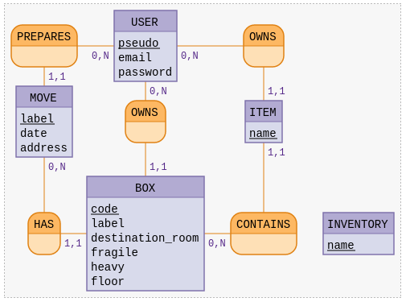

# API Moovybox 

Application serveur réalisée dans le cadre d'un projet de fin de formation. 

## Technologies utilisées

- **Postgres + pgadmin4** : Création et gestion de la base de données
- **Node + Expressjs** : Application serveur
- **Insomnia** : Simulateur de client http

## MVP - Minimum Viable Product 

L'application devait permettre aux pages et actions suivantes : 

- Page d’accueil visiteur
- Formulaire d’inscription
- Connexion aux services
- Création, modification et suppression d’un compte utilisateur
- Création, modification et suppression d’un déménagement
- Envoie d’un mail de rappel peu avant la date du déménagement
- Ajout, modification et suppression de cartons
- Ajout, modification et suppression des options pour chaque carton
- Consultation de la liste des cartons selon certains critères (taille, - destination, statut)
- Réinitialisation du mot de passe
- Déconnexion de l’application

## Conception de la base de données 

Nous avons conçu la base de données suivantes la méthode MERISE et établie le Modèle Conceptuel de Données - *ou MCD* - suivant : 

